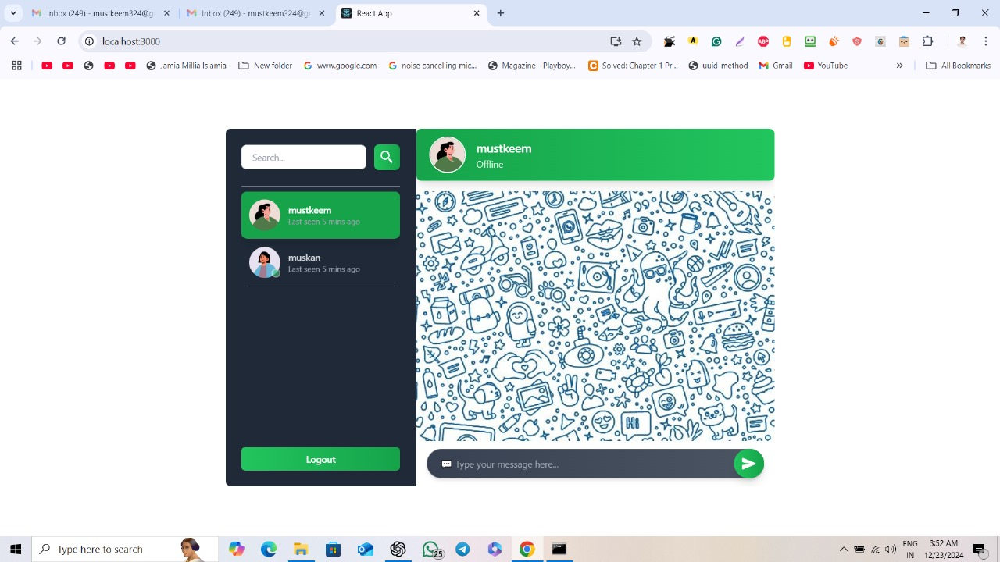

# Live-Chat-Application-Socket.IO

This is a full-stack live chat application built with **Socket.IO** for real-time communication. The project comprises a `client` (frontend) and a `server` (backend). The frontend is built with React, while the backend is powered by Express.

## Features

- Real-time chat functionality using **Socket.IO**.
- User authentication using **JWT**.
- Secure data handling with **bcryptjs** and **dotenv**.
- Scalable backend with **Express** and **MongoDB**.
- State management using **Redux Toolkit** and **React Redux**.
- Modern UI design with **TailwindCSS** and **DaisyUI**.
- Timestamps and formatting with **moment** and **date-fns**.
- Emoji picker using **emoji-mart**.

---
## DEMO IMAGE

## Tech Stack

### Frontend
- **React** (with React Router for navigation)
- **Redux Toolkit** (state management)
- **TailwindCSS** & **DaisyUI** (styling)
- **Socket.IO Client** (real-time communication)

### Backend
- **Node.js** (runtime environment)
- **Express** (framework)
- **MongoDB** (database)
- **Socket.IO** (real-time communication)
- **JWT** (authentication)
- **Bcrypt.js** (password encryption)
- **dotenv** (environment variables)

---

## Installation and Setup

### Prerequisites
- Node.js installed
- MongoDB installed and running

### Backend Setup
1. Navigate to the `server` directory:
   ```bash
   cd server
   ```
2. Install dependencies:
   ```bash
   npm install
   ```
3. Create a `.env` file and set the following variables:
   ```env
   MONGO_URI=your_mongodb_connection_string
   JWT_SECRET=your_jwt_secret
   ```
4. Start the server:
   ```bash
   npm run dev
   ```

### Frontend Setup
1. Navigate to the `client` directory:
   ```bash
   cd client
   ```
2. Install dependencies:
   ```bash
   npm install
   ```
3. Start the development server:
   ```bash
   npm start
   ```

---

## Usage

1. Open the application in your browser (e.g., `http://localhost:3000`).
2. Register or log in to access the chat interface.
3. Join a room or start a conversation to experience real-time messaging.

---

## Scripts

### Backend
- `npm run dev`: Start the server in development mode using `nodemon`.
- `npm start`: Start the server in production mode.

### Frontend
- `npm start`: Start the React development server.
- `npm run build`: Build the project for production.

---

## Folder Structure

### Backend (`server`)
- **index.js**: Main entry point for the backend.
- **routes/**: API routes for user authentication and chat handling.
- **models/**: MongoDB models for users and chat messages.
- **middlewares/**: Middleware for authentication and error handling.

### Frontend (`client`)
- **src/components/**: Reusable React components.
- **src/pages/**: Pages for routing (e.g., login, chat room).
- **src/store/**: Redux Toolkit setup for state management.

---

## Dependencies

### Backend
- `bcryptjs`: Secure password hashing.
- `cookie-parser`: Parse cookies for authentication.
- `cors`: Enable cross-origin requests.
- `dotenv`: Manage environment variables.
- `express`: Backend framework.
- `jsonwebtoken`: Handle JWT authentication.
- `mongoose`: MongoDB ODM.
- `nodemon`: Development utility for automatic server restarts.
- `socket.io`: Real-time bidirectional communication.

### Frontend
- `@reduxjs/toolkit`: Simplified Redux setup.
- `axios`: HTTP requests.
- `emoji-mart`: Emoji picker.
- `moment` & `date-fns`: Date and time manipulation.
- `react-icons`: Icon library.
- `react-router-dom`: Navigation and routing.
- `socket.io-client`: Real-time communication.

---

## Contributing

1. Fork the repository.
2. Create a feature branch:
   ```bash
   git checkout -b feature-name
   ```
3. Commit your changes:
   ```bash
   git commit -m "Add new feature"
   ```
4. Push the branch and open a pull request.

---

## License

This project is licensed under the **ISC License**.

---

## Contact

For any inquiries, feel free to reach out at [your-email@example.com].
